# **Exercícios Docker (Sem a aplicação dos Exemplos)**

[Com a utilização dos exemplos](https://github.com/Daijinpala/Exem-docker)

### 🟢 **Fácil**

1. **Rodando um container básico**
    - Execute um container usando a imagem do **Nginx** e acesse a página padrão no navegador.
    - 🔹 _Exemplo de aplicação:_ Use a [landing page do TailwindCSS](https://github.com/tailwindtoolbox/Landing-Page) como site estático dentro do container.

**Flavor**:
- Documentação: https://hub.docker.com/_/nginx
- docker pull nginx:1.27
- Criar um container com a imagem e acessar a porta no navegador.
- docker run --name nome-container -d -p 8080:80 nome-imagem

    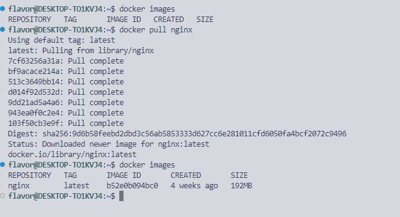
    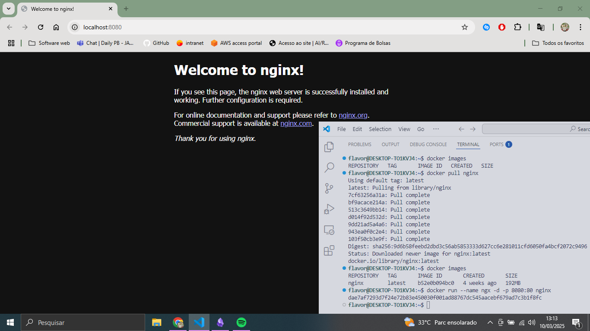

2. **Criando e rodando um container interativo**
    - Inicie um container **Ubuntu** e interaja com o terminal dele.
    - 🔹 _Exemplo de aplicação:_ Teste um script Bash que imprime logs do sistema ou instala pacotes de forma interativa.

**Flavor:**
- documentação: https://hub.docker.com/_/ubuntu
- docker pull ubuntu:noble
- docker run -dti --name novo_nome-container nome_da_imagem
- docker exec -ti nome_do_caontainer bash

    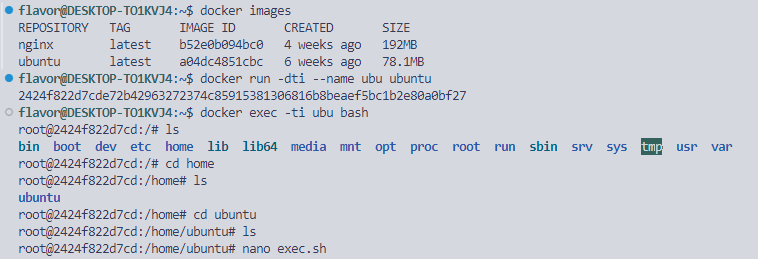

Dentro do container:
- Atualizar a maquina (apt update && apt upgrade)
- Baixar o nano (apt install nano)

nano exec.sh:

```
#!/bin/bash

apt update
apt upgrade -y
apt autoremove -y
```

- Dar permissão de execução para o .sh (chmod +x nomedo.sh)
- Executar ele: ./nomedo.sh


    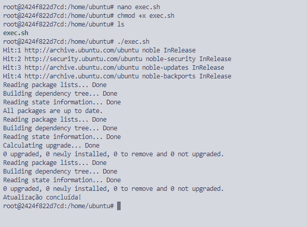

3. **Listando e removendo containers**
    - Liste todos os containers em execução e parados, pare um container em execução e remova um container específico.
    - 🔹 _Exemplo de aplicação:_ Gerenciar containers de testes criados para verificar configurações ou dependências.

**Flavor**:

- docker ps -a (lista os containers parados e os em execução)
- docker stop nome-do-container
- docker rm nome-do-container
    
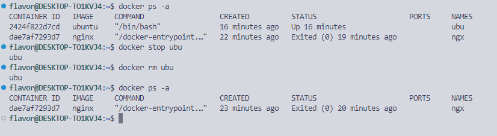

4. **Criando um Dockerfile para uma aplicação simples em Python**
    - Crie um `Dockerfile` para uma aplicação **Flask** que retorna uma mensagem ao acessar um endpoint.
    - 🔹 _Exemplo de aplicação:_ Use a API de exemplo [Flask Restful API Starter](https://github.com/gothinkster/flask-realworld-example-app) para criar um endpoint de teste.

 **Flavor:**
 - Criar uma pasta para coneter nossa aplicação
 
 Dentro da pasta:
 
 - Criar um arquivo app.py
 - Criar um arquivo requirements.txt
 - Criar um Dockerfile

Após a criação dos arquivos:

- docker build . -t nome-imagem
- docker run -dti --name nome-container -p 5000:5000 nome-imagem

nano `app.py`:
```
from flask import Flask

app = Flask(__name__)

@app.route('/')
def padaria():
    return 'Não temos pão duro'

if __name__ == '__main__':
    app.run(host='0.0.0.0', port=5000)
```

nano `requirements.txt`
```
Flask==2.3.2
```

nano `dockerfile`
```
FROM python:3.13

WORKDIR /app

COPY requirements.txt .

RUN pip install --no-cache-dir -r requirements.txt

COPY . .

EXPOSE 5000

CMD ["python", "app.py"]
```
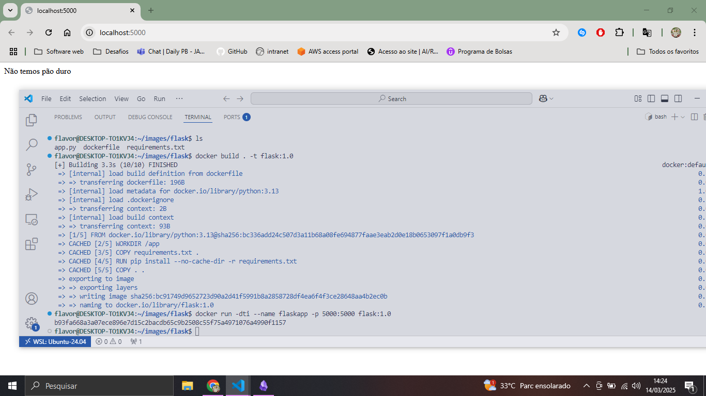

<br>
<div>
<details align="left">
    <summary>Executando o phyton sem o flask: </summary>
    
- Primeiro criei uma pasta para separar os conteúdos das imagens (images)
- Criei uma pasta que conterá o Dockerfile (ubuntu-python)
- Dentro da mesma pasta criei o arquivo app.py

    **Dockerfile:**
    ```dockerfile
    FROM ubuntu

    RUN apt update && apt upgrade -y && apt install -y python3 && apt install nano -y && apt clean

    COPY app.py /opt/app.py

    CMD python3 /opt/app.py
    ```

    **Script `app.py`:**
    ```python
    nome = input("Qual é o seu nome: ")
    print(nome)
    ```

    **Comandos:**
    ```bash
    docker build . -t minha-imagem-python
    docker run -dti --name meu-container-python minha-imagem-python
    docker exec -ti meu-container-python python3 /opt/app.py
    ```

    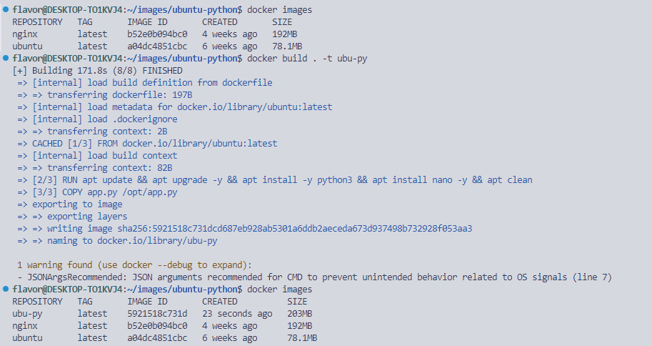
  
    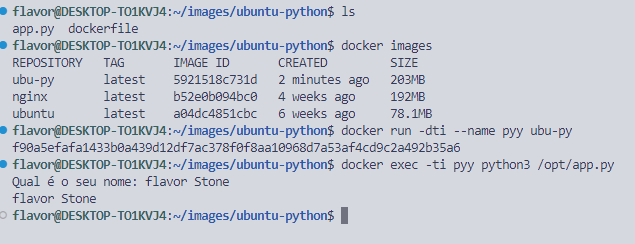
  
</details>
</div>
<br>

<hr>

### 🟡 **Médio**

5. **Criando e utilizando volumes para persistência de dados**
    - Execute um container **MySQL** e configure um volume para armazenar os dados do banco de forma persistente.
    - 🔹 _Exemplo de aplicação:_ Use o sistema de login e cadastro do [Laravel Breeze](https://github.com/laravel/breeze), que usa MySQL.

Primeiro criar um volume para guardar as informações do mysql:
 - docker volume create nome-do-volume
 - docker volume ls (vai listar os volumes)
 - docker run -e MYSQL_ROOT_PASSWORD=0311 -dti -p 3306-3306 --name nome-container --mount type=volume,src=mysql,dst=/var/lib/mysql mysql

     **Explicação `docker run`:**
    ```
    -e MYSQL_ROOT_PASSWORD=0311 > você ta indicando a senha
    - --name mysql1  > voce está dando um nome ao container
    - -d  > falando que vai funcionar background
    - -p 3306-3306  > está especificando a porta de entrada e saida do container
    -  type=volume,src=mysql,dst=/var/lib/mysql mysql > está passando o volume do so e logo após a pasta que está os arquivos do mysql.
    - mysql > passando o nome da imagem do container que será utilizada
    ```

Entrar dentro do container_1 utilizando o bash (mysql1):
- docker exec -ti nome_do_caontainer bash

Entrar dentro do mysql:
-  mysql -u root -p --protocol=tcp --port=3306

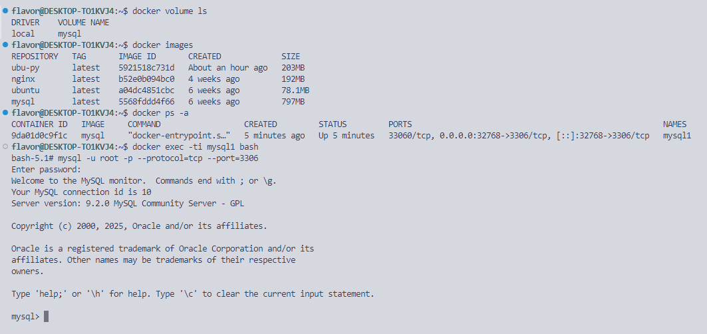

**comandos `mysql` utilizados:**

    ```
    -- mostra todas as databases
    show databases;
    -- cria a database fazenda
    create database fazenda;
    -- especifica a database que será utilizada
    use fazenda;
    
    -- cria a tabela horta
    CREATE TABLE horta (id INTEGER PRIMARY KEY,name TEXT NOT NULL,qtd INTEGER NOT NULL);
    
    -- preenche os valores na tabela horta
    INSERT INTO horta VALUES (1, 'Batata', 5);
    INSERT INTO horta VALUES (2, 'Banana', 12);
    ```

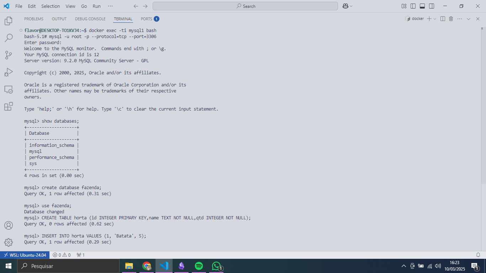

Agora dentro de uma segunda vm com o mysql (vulgo mysql2)

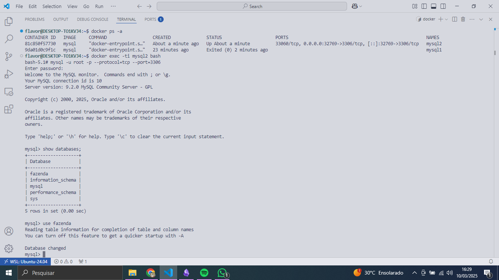

**Comandos utilizados no segundo container (mysql2):**
```
show databases;
-- Mostra os valores dos alimentos com quantidade maior que 5
SELECT * FROM horta WHERE qtd >= 5;
```

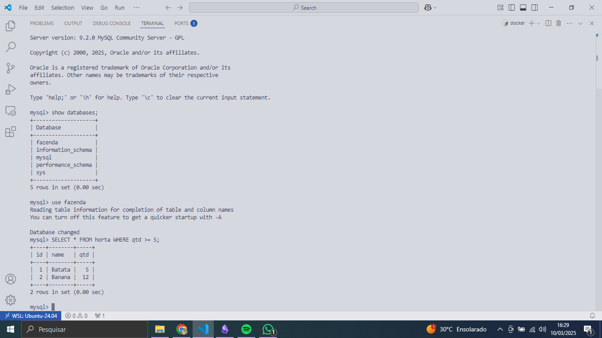

6. **Criando e rodando um container multi-stage**
    - Utilize um **multi-stage build** para otimizar uma aplicação **Go**, reduzindo o tamanho da imagem final.
    - 🔹 _Exemplo de aplicação:_ Compile e rode a API do [Go Fiber Example](https://github.com/gofiber/recipes/tree/main/docker-multistage-build "https://github.com/gofiber/recipes/tree/main/docker-multistage-build") dentro do container.

flavor:
Entrar no docker hub e baixar a imagem do golang e uma versão minima do linux(alpine)
- Documentação golang: https://hub.docker.com/_/golang
- Documentação alpine: https://hub.docker.com/_/alpine

 Criar uma pasta para um container multi-stage utilizando go & alpine
- cd images 
- mkdir go
- cd go

No SO:
- docker pull golang
- docker pull alpine

nano app.go
```
package main
import(
  "fmt"
)
func main(){
fmt.Println("Qual é o seun nome: ?")
var name string
fmt.Scanln(&name)
fmt.Printf("Oi, %s! Eu sou a linguagem Go", name)
}
```

nano dockerfile:
```
FROM golang as exec

COPY app.go /go/src/app/

ENV GO111MODULE=auto

WORKDIR /go/src/app/

RUN go build -o app.go .

FROM alpine

WORKDIR /appexec

COPY --from=exec /go/src/app /appexec

RUN chmod -R 755 /appexec

ENTRYPOINT ./app.go
```

Criar a imagem baseado no dockerfile:
- docker image build -t nome-imagem .

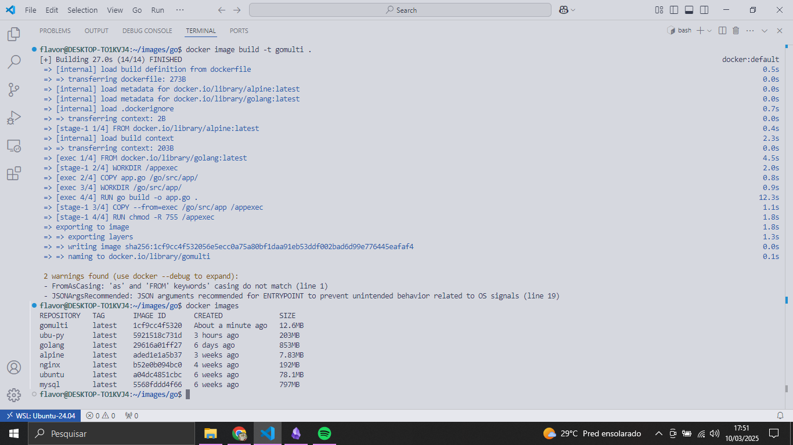

Iniciar o container:
- docker run -ti --name nome-container nome-imagem

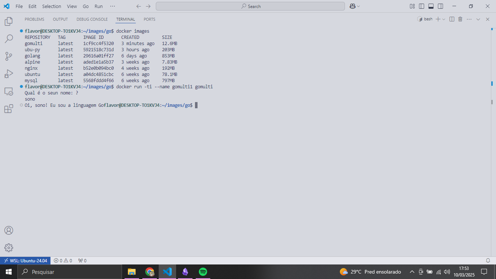

7. **Construindo uma rede Docker para comunicação entre containers**
    - Crie uma rede Docker personalizada e faça dois containers, um **Node.js** e um **MongoDB**, se comunicarem.
    - 🔹 _Exemplo de aplicação:_ Utilize o projeto [MEAN Todos](https://github.com/luanphandinh/mean-todo "https://github.com/luanphandinh/mean-todo") para criar um app de tarefas usando Node.js + MongoDB.

flavor:
Criar uma rede:
- docker network create nome_da_rede
- docker network ls  (lista as redes disponiveis)

Baixar as imagens node.js e mongodb:
- Documentação: https://hub.docker.com/_/node
- Documentação: https://hub.docker.com/r/mongodb/mongodb-community-server

- docker pull node
- docker pull mongodb/mongodb-community-server

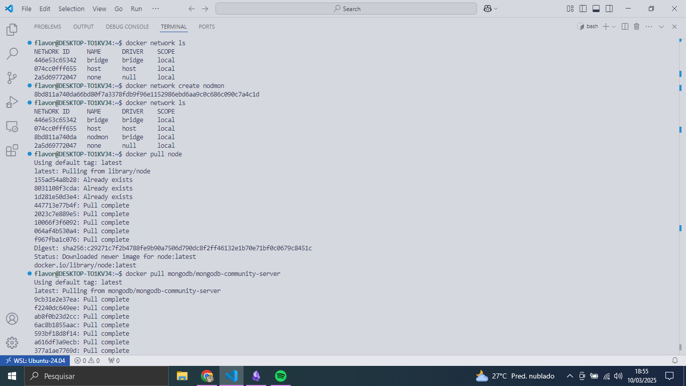

Ao criar os containers especificar a rede que irá utilizar:
- docker run -dti --name nod --network nodmon node
- docker run --name mon -d -p 27017:27017 --network nodmon mongodb/mongodb-community-server:$MONGODB_VERSION
- docker run -dti --name nome-container --network nome_da_rede nome-imagem

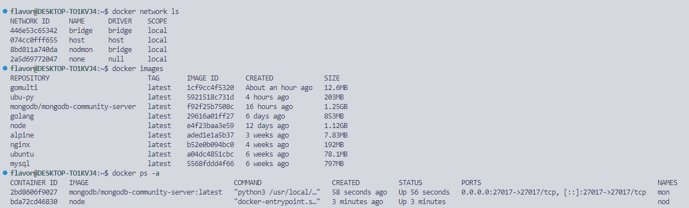

- docker network inspect nomerede (mostra quais containers estão na rede especifica)

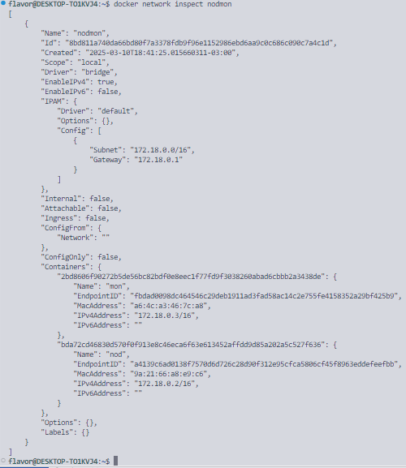


Entrar no container:
- docker exec -ti nome_do_caontainer bash

Dentro dos dois containers:
```
apt update
apt get-install -y iputils-ping
```

Por fim é só pingar e ver o resultado:

container com o node.js ip: 172.18.0.2
container com o mongodb ip:  172.18.0.3

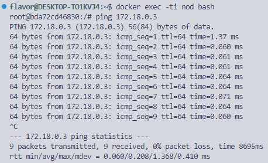

8. **Criando um compose file para rodar uma aplicação com banco de dados**
    - Utilize **Docker Compose** para configurar uma aplicação **Django** com um banco de dados **PostgreSQL**.
    - 🔹 _Exemplo de aplicação:_ Use o projeto [Django Polls App](https://github.com/databases-io/django-polls "https://github.com/databases-io/django-polls") para criar uma pesquisa de opinião integrada ao banco.

---

### 🔴 **Difícil**

9. **Criando uma imagem personalizada com um servidor web e arquivos estáticos**
    - Construa uma imagem baseada no **Nginx** ou **Apache**, adicionando um site HTML/CSS estático.
    - 🔹 _Exemplo de aplicação:_ Utilize a [landing page do Creative Tim](https://github.com/creativetimofficial/material-kit "https://github.com/creativetimofficial/material-kit") para criar uma página moderna hospedada no container.

<br>

- Criar uma pasta para colocar os arquivos gerais
- Baixar uma imagem fixa do nginx 

Dentro da pasta:

- Criar um index.html
- Criar um style.css
- Criar um nginx.conf
- Após a criação dos arquivos, criar um `dockerfile`

Só executar o container e ser feliz

-  docker image build -t nome-imagem .
-  docker run -dti --name nome-container -p 8080:80 nome-imagem

<br>

nano `index.html`:
```
<!DOCTYPE html>
<html lang="pt-BR">
<head>
    <meta charset="UTF-8">
    <meta name="viewport" content="width=device-width, initial-scale=1.0">
    <title>Meu Site Simples</title>
    <link rel="stylesheet" href="style.css">
</head>
<body>
    <header>
        <h1>Bem-vindo ao Meu Site Simples</h1>
    </header>
    <main>
        <p>Este é um exemplo de uma página HTML/CSS simples.</p>
    </main>
    <footer>
        <p>&copy; 2023 Meu Site Simples</p>
    </footer>
</body>
</html>
```

<br>

nano `style.css`:
```
body {
    font-family: Arial, sans-serif;
    margin: 0;
    padding: 0;
    background-color: #f4f4f4;
    color: #333;
}

header {
    background-color: #333;
    color: #fff;
    padding: 20px;
    text-align: center;
}

main {
    padding: 20px;
    text-align: center;
}

footer {
    background-color: #333;
    color: #fff;
    text-align: center;
    padding: 10px;
    position: fixed;
    bottom: 0;
    width: 100%;
}
```

nano `nginx.conf`:

```
server {
    listen 80;
    server_name localhost;

    location / {
        root /usr/share/nginx/html;
        index index.html;
    }
}
```

nano `dockerfile`:
```
FROM nginx:alpine

COPY index.html /usr/share/nginx/html/
COPY style.css /usr/share/nginx/html/
COPY nginx.conf /etc/nginx/conf.d/default.conf

EXPOSE 80

CMD ["nginx", "-g", "daemon off;"]
```

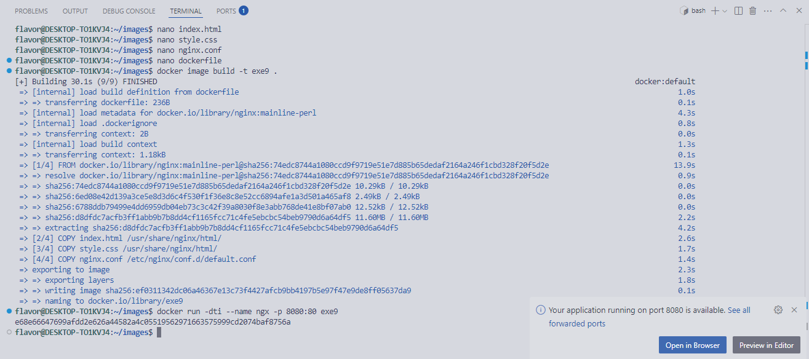
<br>
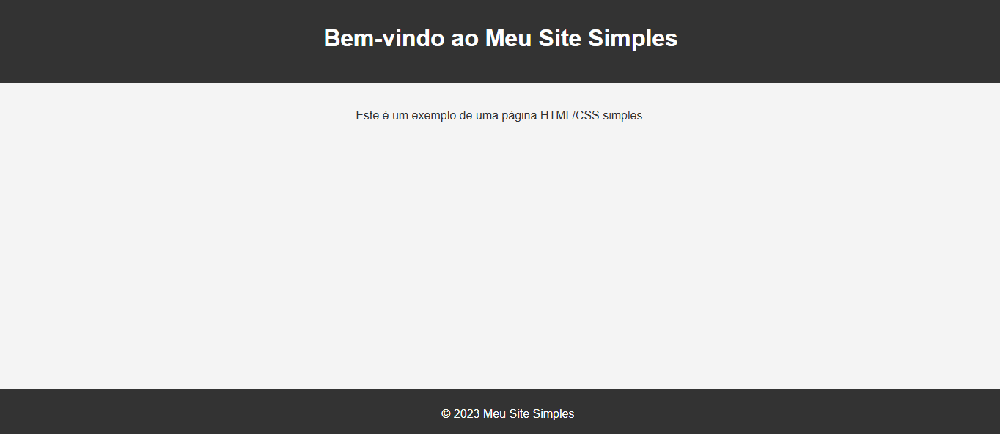


<br>
<div>
<details align="left">
    <summary>Utilizando o debian: </summary>

Documentação debian: https://hub.docker.com/_/debian
Documentação apache: https://hub.docker.com/_/httpd

- docker pull httpd
- docker pull debian

No SO:
sudo apt install wget (para colocarmos o arquivo do site em um .tar)

Criar uma pasta que contenha a criação da imagem:
- cd /images
- mkdir debian-apache
- cd /debian-apache
- mkdir site
- cd site

Dentro da pasta site:
- Criar um index.html básico
- Criar um style.css básico

Index.html:
```
<!DOCTYPE html>
<html lang="pt-BR">
<head>
    <meta charset="UTF-8">
    <meta name="viewport" content="width=device-width, initial-scale=1.0">
    <title>Meu Site Simples</title>
    <link rel="stylesheet" href="style.css">
</head>
<body>
    <header>
        <h1>Bem-vindo ao Meu Site Simples</h1>
    </header>
    <main>
        <p>Este é um exemplo de uma página HTML/CSS simples.</p>
    </main>
    <footer>
        <p>&copy; 2023 Meu Site Simples</p>
    </footer>
</body>
</html>
```

Style.css:
```
body {
    font-family: Arial, sans-serif;
    margin: 0;
    padding: 0;
    background-color: #f4f4f4;
    color: #333;
}

header {
    background-color: #333;
    color: #fff;
    padding: 20px;
    text-align: center;
}

main {
    padding: 20px;
    text-align: center;
}

footer {
    background-color: #333;
    color: #fff;
    text-align: center;
    padding: 10px;
    position: fixed;
    bottom: 0;
    width: 100%;
}
```


- tar -czf site.tar ./
- cp site.tar ../
- rm --Rf site

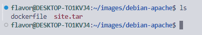

Dentro da pasta debian-apache:
- criar um dockerfile

dockerfile:
```
FROM debian

RUN apt-get update && apt-get install -y apache2 && apt-get clean

ENV APACHE_LOCK_DIR="var/lock"
ENV APACHE_PID_FILE="var/run/apache2.pid"
ENV APACHE_RUN_USER="www-data"
ENV APACHE_RUN_GROUP="www-data"
ENV APACHE_LOG_DIR="/var/log/apache2"

ADD site.tar /var/www/html

LABEL description = "Apache webserver 1.0"

VOLUME /var/www/html

EXPOSE 80

ENTRYPOINT ["/usr/sbin/apachectl"]

CMD ["-D","FOREGROUND"]
```

Criar a imagem:
- docker image build -t nome-imagem .

Executar o container e ser feliz:
- docker run -dti -p 80:80 --name nome-container nome-imagem

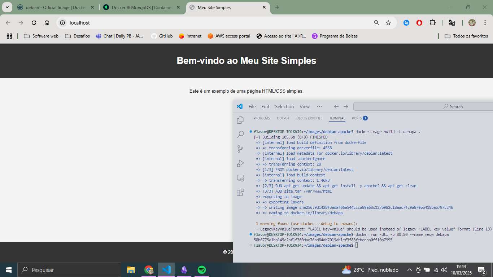

</details>
</div>
